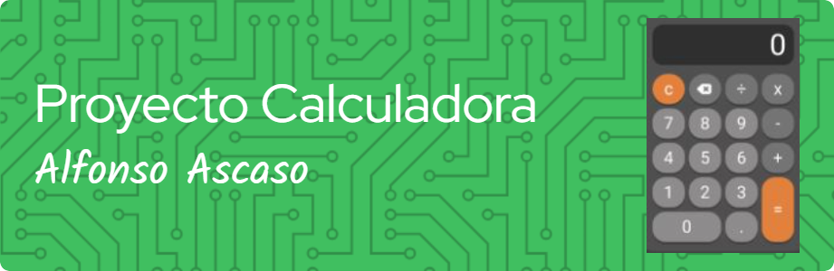
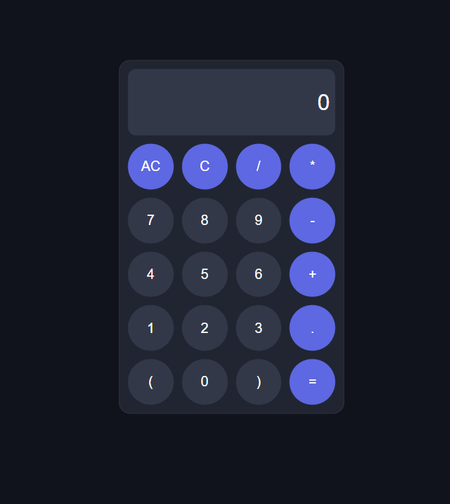

# 📟 Calculadora Simple

Este proyecto es una 🧮 calculadora simple desarrollada en **HTML**, **CSS** y **JavaScript**. Permite realizar operaciones aritméticas básicas (➕ suma, ➖ resta, ✖️ multiplicación y ➗ división) de manera sencilla.

## 📘 Descripción del Proyecto

La calculadora consta de una pantalla (input) donde se muestran los números y resultados de las operaciones, y botones para los números y operaciones aritméticas.

### ✨ Funcionalidades

1. **🧹 wipe**: Borra el contenido de la pantalla.
2. **📲 show**: Añade un carácter o número al contenido actual de la pantalla.
3. **🧮 calc**: Calcula la expresión matemática mostrada en la pantalla y muestra el resultado.

## 🚀 Uso

Para usar la calculadora, simplemente abre el archivo `index.html` en tu navegador web. Podrás ingresar números y operaciones aritméticas utilizando los botones, y ver el resultado en la pantalla al presionar el botón "=".

### 📋 Ejemplo de Uso

1. Abre el archivo `index.html` en tu navegador.
2. Usa los botones numéricos para ingresar números.
3. Usa los botones de operación `(+, -, *, /)` para realizar operaciones aritméticas.
4. Presiona el botón "=" para ver el resultado de la operación.
5. Usa el botón `"C"` o `"AC"` para borrar el contenido de la pantalla.

## 🗂️ Estructura del Proyecto

- **index.html**: Contiene la estructura HTML de la calculadora y el código JavaScript mediante la etiqueta `script` y especificando la URL del archivo de script externo con el atributo `src` para su correcto funcionamiento.

### 💻 Código JavaScript

- **display**: Selecciona el elemento HTML con el id `screen` y lo guarda en la variable `display`.
- **wipe**: Borra el contenido de la pantalla.
- **show**: Añade un carácter o número al contenido actual de la pantalla.
- **calc**: Evalúa la expresión matemática que se muestra en la pantalla y muestra el resultado.

```javascript
let display = document.getElementById('screen');

const wipe = () => {
    display.value = '';
}

const show = (n) => {
    display.value += n;
}

const calc = () => {
    let resultado = eval(display.value);
    display.value = resultado.toFixed(2);
}
```

## 📥Instalación

No se requiere instalación. Simplemente descarga el archivo `index.html` y ábrelo en tu navegador web.

## 🖼️Resultado final

La calculadora simple se verá como se muestra a continuación:


## 🤝Contribución

Las contribuciones son bienvenidas. Si encuentras algún problema o tienes sugerencias para mejorar la calculadora, por favor crea un un "pull request" en el repositorio.

> [!NOTE]\
> 💡Disfruta usando tu calculadora simple y no dudes en mejorarla según tus necesidades.😄

